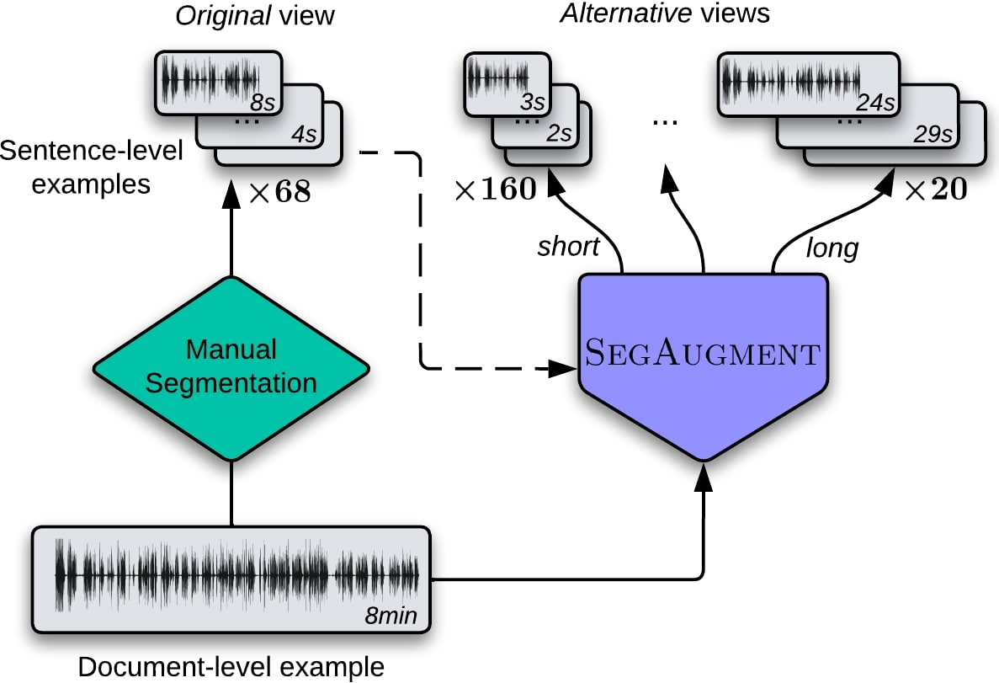

# SegAugment: Maximizing the Utility of Speech Translation Data with Segmentation-based Augmentations

The pre-print of this research is available [here](https://arxiv.org/abs/2212.09699).

<em>
Data scarcity is one of the main issues with the end-to-end approach for Speech Translation, as compared to the cascaded one. Although most data resources for Speech Translation are originally document-level, they offer a sentence-level view, which can be directly used during training. But this sentence-level view is single and static, potentially limiting the utility of the data. Our proposed data augmentation method SegAugment challenges this idea and aims to increase data availability by providing multiple alternative sentence-level views of a dataset. Our method heavily relies on an Audio Segmentation system to re-segment the speech of each document, after which we obtain the target text with alignment methods. The Audio Segmentation system can be parameterized with different length constraints, thus giving us access to multiple and diverse sentence-level views for each document. Experiments in MuST-C show consistent gains across 8 language pairs, with an average increase of 2.2 BLEU points, and up to 4.7 BLEU for lower-resource scenarios in mTEDx. Additionally, we find that SegAugment is also applicable to purely sentence-level data, as in CoVoST, and that it enables Speech Translation models to completely close the gap between the gold and automatic segmentation at inference time.
</em>

&nbsp;



## Citation

```bash
@misc{https://doi.org/10.48550/arxiv.2212.09699,
  doi = {10.48550/ARXIV.2212.09699},
  url = {https://arxiv.org/abs/2212.09699},
  author = {Tsiamas, Ioannis and Fonollosa, José A. R. and Costa-jussà, Marta R.},
  keywords = {Computation and Language (cs.CL), Sound (cs.SD), Audio and Speech Processing (eess.AS)},
  title = {{SegAugment: Maximizing the Utility of Speech Translation Data with Segmentation-based Augmentations}},
  publisher = {arXiv},
  year = {2022},
  copyright = {arXiv.org perpetual, non-exclusive license}
}
```

## Augmented Datasets

Here you can download the generated data from SegAugment for MuST-C, mTEDx and CoVoST.

The format is similar to the one found in MuST-C and mTEDx:

* .src: A text file with the transcription for each example
* .tgt: A text file with the translation for each example
* .yaml: A yaml file with the offset, duration and corresponding audio file for each example

MuST-C

|En-De (v2.0)|[short](https://drive.google.com/uc?export=download&id=1v5B_974Xp_UXjy8VH5eXZgzqHHSGduRZ)|[medium](https://drive.google.com/uc?export=download&id=1v4wQyhH6laOgCCVW_WS-5Jy9w-KnCQY9)|[long](https://drive.google.com/uc?export=download&id=1uyKf0E6b8NhCEfJzrUxtTrmHViKq5vDC)|[extra-long](https://drive.google.com/uc?export=download&id=1usaybFjJC-gu4ARxosBzZjNlJNCCC2WX)|
|---|---|---|---|---|
|En-Es|[short](https://drive.google.com/uc?export=download&id=1sbNhHpfR_IIfUWvbb7g2FxMP_sn0DKkl)|[medium](https://drive.google.com/uc?export=download&id=1s_ZGShc1WODNgrt1UT87DkhdGKXvweVx)|[long](https://drive.google.com/uc?export=download&id=1sQO0iYEfbNUdS11rDMCb9YGTOZMIl6DH)|[extra-long](https://drive.google.com/uc?export=download&id=1sLPjnbpaMnmvOmYMnCIRviuIWtiuZCNG)|
|En-Fr|[short](https://drive.google.com/uc?export=download&id=1szYcZfP9pFrAA6KN4oTpc5HouxAqxb8u)|[medium](https://drive.google.com/uc?export=download&id=1snpZjKGYRPJ3zu0f2HNWHgihByAQBklk)|[long](https://drive.google.com/uc?export=download&id=1sesgB_MUNnR5pHtuULn3kBLilHuZtctF)|[extra-long](https://drive.google.com/uc?export=download&id=1sgb9Am1doggPsVfeDrMCs6Y6qvpN4uiz)|
|En-It|[short](https://drive.google.com/uc?export=download&id=1tEDm93gCyAJUU0-UnsomVRGPJeXu0nxU)|[medium](https://drive.google.com/uc?export=download&id=1t8H1Bvid0wO4deWbm0YUNmnRsycCnSbl)|[long](https://drive.google.com/uc?export=download&id=1tD6N5wzFH9EgLCAA6MvAxXjvnd6YevQ9)|[extra-long](https://drive.google.com/uc?export=download&id=1snzkp73RPjZ8nGTcPdomiay0lQWoKoep)|
|En-Nl|[short](https://drive.google.com/uc?export=download&id=1tUVRKhhl7saQGsVDIeHfbMpzgTcWK-xq)|[medium](https://drive.google.com/uc?export=download&id=1tOnmjaaerpvNi3dd0UqYgUD35pOYWCAp)|[long](https://drive.google.com/uc?export=download&id=1tP4cAyDFXBj6ixDHff1CoOcxF2epaebS)|[extra-long](https://drive.google.com/uc?export=download&id=1tKnGKjOk6l4IlJjH22pHb7CTlk3_h68w)|
|En-Pt|[short](https://drive.google.com/uc?export=download&id=1ts_GRYUbLSGJcWwMTCMORJqRgUjDJLnD)|[medium](https://drive.google.com/uc?export=download&id=1tv8RKkC9BSHo4OyWmtrzLSux1eVlqUWo)|[long](https://drive.google.com/uc?export=download&id=1tuevLRQDSaJ0qTsP2kCla8uybMz2FKPk)|[extra-long](https://drive.google.com/uc?export=download&id=1taZXQ-dY_4aMjVr4higdkbebaT-uBI66)|
|En-Ro|[short](https://drive.google.com/uc?export=download&id=1uJNAqL4Cg5EE9Nup_eHCl7-WFYJ4qC8M)|[medium](https://drive.google.com/uc?export=download&id=1uC7rE6YiHimgJKgVBgZ0_N0t-YDzwuBR)|[long](https://drive.google.com/uc?export=download&id=1uAHFxmvP5Nyxgqy5ivyeFiBzJeDQd03Z)|[extra-long](https://drive.google.com/uc?export=download&id=1u-80RjJy3fpf_1Sm8inKOW-gIknpdvep)|
|En-Ru|[short](https://drive.google.com/uc?export=download&id=1us_0aZab16a_Lz_EH9fDEYVjTCJeuRkg)|[medium](https://drive.google.com/uc?export=download&id=1uWWe5rjFpK019ISi3oS18UWsJ7WodH2Z)|[long](https://drive.google.com/uc?export=download&id=1uSk9V9W0R-bsygzKxEXx_c6C-qeInHGR)|[extra-long](https://drive.google.com/uc?export=download&id=1uJrLlydTW_UjfydFuHqJ_2-8BUtOjm06)|

mTEDx

|Es-En|[short](https://drive.google.com/uc?export=download&id=1r_NltYeAoimyJIFgub8MJ9f6zESq-VCN)|[medium](https://drive.google.com/uc?export=download&id=1rXuli-c1bdE0pnF0k2e1Rmgo73kxKLA3)|[long](https://drive.google.com/uc?export=download&id=1rZt9-PpbsWkZxFGaImqzJkvuzZ4E8Ehw)|[extra-long](https://drive.google.com/uc?export=download&id=1rTRtSS9HMx6Sb_uupGN4cshdNQ142JWC)|
|---|---|---|---|---|
|Es-Fr|[short](https://drive.google.com/uc?export=download&id=1rtC4gGn1AeNPNjKY-ckvheS4Yo06h-NU)|[medium](https://drive.google.com/uc?export=download&id=1rTRtSS9HMx6Sb_uupGN4cshdNQ142JWC)|[long](https://drive.google.com/uc?export=download&id=1rlYgpBIE0zECVWCcc0SWxdhV2Phe_M18)|[extra-long](https://drive.google.com/uc?export=download&id=1rozUGTFvWg4EmCNDUOwXuWeR5FnNdCLn)|
|Pt-En|[short](https://drive.google.com/uc?export=download&id=1sB0haJofpIvtcXAuEqnEHnEjuSEcMcJI)|[medium](https://drive.google.com/uc?export=download&id=1sIc9nbQYaN-TaJNCXeZlexs2xYNZjQCb)|[long](https://drive.google.com/uc?export=download&id=1sB27P4r4VjCtHFnEI7Jf1LhgI5jaQpc4)|[extra-long](https://drive.google.com/uc?export=download&id=1rq4n_wlMijHXZ6zmxlc7o4ypVf_dUMzu)|
|Es-Es|[short](https://drive.google.com/uc?export=download&id=1rxez5cbcRjHVPVktvtIfagIL8P-9XCw2)|[medium](https://drive.google.com/uc?export=download&id=1rq4GPYtTzWX_-BfwMAQr1miCNLmCycYa)|[long](https://drive.google.com/uc?export=download&id=1reTKhYAleALZZRVOdC9YG0JXEl_nvavT)|[extra-long](https://drive.google.com/uc?export=download&id=1rd0pYjijNWUlJVrFVri8O3ODsuEo3U0R)|
|Pt-Pt|[short](https://drive.google.com/uc?export=download&id=1sXhFDtj508ABBYA8YV2zjcTo5m1KnsH6)|[medium](https://drive.google.com/uc?export=download&id=1sNM5qomeguAO89aNK8Yudw2R6v0Ggr87)|[long](https://drive.google.com/uc?export=download&id=1sPjUUEyo17dZpOtTIem-F7O5q1OZEM5I)|[extra-long](https://drive.google.com/uc?export=download&id=1sJa-rERFPChwUAMKsONGMY1-w3w3-_73)|

CoVoST

|En-De|[short](https://drive.google.com/uc?export=download&id=1v98N0eUS5cKDkvcEmN3I9tAAinaylKqasharing)|[medium](https://drive.google.com/uc?export=download&id=1v9hvRhoJWfi7ASBtvYzVQRN1wcecXMgf)|
|---|---|---|

To use the data for Speech Translation you will have to also download the original audio files for each dataset.

## Code and Instructions for using SegAugment

Under construction...